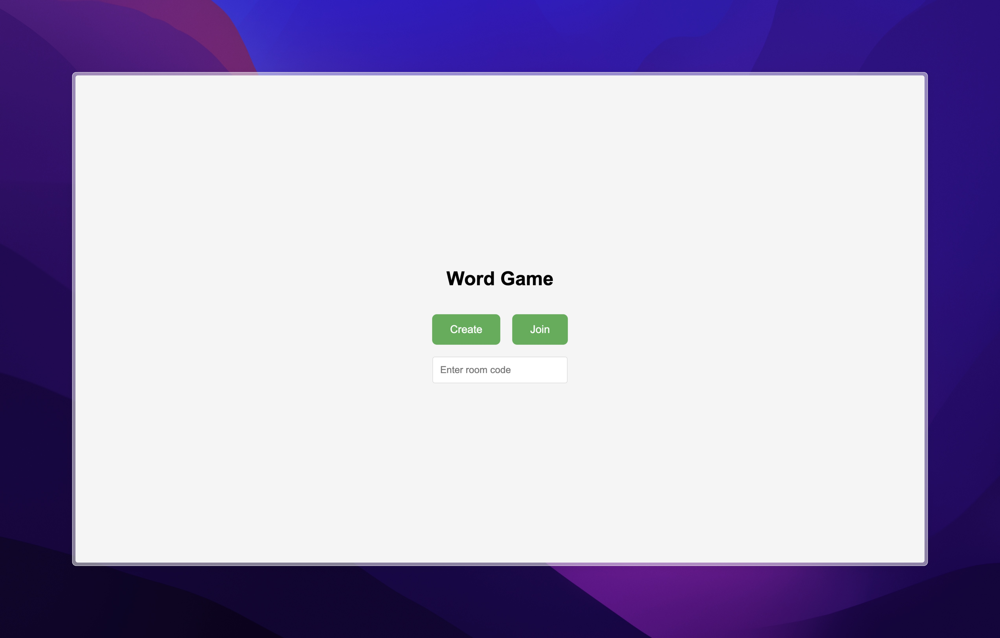
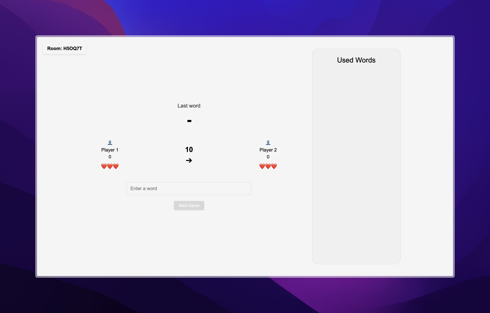

# Word Chain Game

This was a project I did for my web dev class. I wanted to learn more about networking and websockets, which is why I built this multiplayer word chain game.

Players take turns creating words where each new word must start with the last letter of the previous one. You can play it over your local network in real time using WebSockets.

## Screenshots

Main screen:


In-game:


## How to Play

1. Click "Create" to start a new game room
2. Share the 6-character room code with a friend
3. The second player enters the room code to join
4. Take turns submitting words that start with the last letter of the previous word
5. Last player standing wins

## Game Rules

- Each word must start with the last letter of the previous word
- Words cannot be repeated
- Players have 3 lives each
- Invalid words result in losing a life
- Game ends when a player runs out of lives

## Tech Stack

- Node.js, Express
- WebSockets (ws library)
- Vanilla JavaScript, HTML5, CSS3
- Dictionary API (dictionaryapi.dev)

## Setup

1. Clone the repository
   ```bash
   git clone https://github.com/alibizho/word-game.git
   cd wordgame
   ```

2. Install dependencies
   ```bash
   npm install
   ```

3. Start the server
   ```bash
   npm start
   ```

4. Open `http://localhost:3000` in your browser

The server runs on port 3000 by default. You can change this by setting the `PORT` environment variable.
